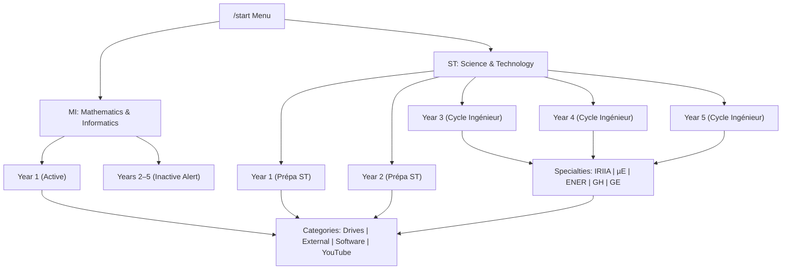

# Technical Documentation: ERISE Academic Resource Telegram Bot

**Organization:** ERISE Scientific Club  
**Institution:** National Higher School of Renewable Energies, Environment & Sustainable Development (HNS RE2SD Batna)  
**Bot Username:** [@erise_telegram_bot](https://t.me/erise_telegram_bot)  
**Repository:** [https://github.com/ayoubberbache/erise-telegram-bot](https://github.com/ayoubberbache/erise-telegram-bot)  

---

## 1. Executive Summary

The **ERISE Academic Resource Telegram Bot** is a high-performance, asynchronous Telegram bot built with Python 3.12 and `python-telegram-bot` v21+. It provides students at **HNS RE2SD Batna** with a fast, structured, and branch-aware navigation portal to access official course drives, archived exams, recommended software tools with installation notes, external academic repositories, and curated YouTube playlists.

The bot is designed to run **24/7 on Render's Free Tier** using an integrated **Dual-Core Architecture** combining Telegram long-polling and an embedded HTTP health-check server.

---

## 2. System Architecture

### 2.1 Dual-Core Engine Design

Render's Free Tier spins down web services after 15 minutes of inactivity if no HTTP requests are received. Headless background workers on Render require a paid plan. To solve this, the application implements a dual-core architecture inside a single process:

1. **Telegram Engine (`bot.py`)**: Asynchronous worker running continuous long polling (`run_polling()`) to deliver real-time Telegram updates.
2. **HTTP Health Server (`keep_alive.py`)**: Embedded `ThreadingHTTPServer` running on a background daemon thread, listening on port `$PORT` (default `10000`). It answers health probes at `/`, `/health`, and `/healthz` with HTTP `200 OK`.

```mermaid
flowchart TD
    subgraph Render_Free_Web_Service ["Render Free Web Service (Single Process)"]
        direction TB
        Main["bot.py (Entry Point)"]
        Main --> Polling["Telegram Async Poller (python-telegram-bot)"]
        Main --> HTTPServer["Embedded HTTP Health Server (keep_alive.py)"]
        HTTPServer -.-> Port["Binds to 0.0.0.0:$PORT"]
    end

    Student["Students on Telegram"] <-->|Messages & Callbacks| TGServers["Telegram Cloud Servers"]
    TGServers <-->|Long Polling (HTTPS)| Polling
    
    ExternalPinger["External Monitor (UptimeRobot / Cron / Sentinel)"] -->|HTTP GET /health (Every 5–10 min)| Port
```

---

## 3. Academic Structure & Routing Logic

### 3.1 Department & Specialty Tree

The navigation tree strictly reflects the academic curricula of HNS RE2SD:



### 3.2 Engineering Specialties
- **IRIIA**: Ingénierie des Réseaux Intelligents & Intelligence Artificielle (Smart Grids, AI, IoT, Networks)
- **µE**: Microélectronique (Embedded Systems, FPGA, Semiconductors)
- **ENER**: Énergétique & Énergies Renouvelables (Solar, Wind, Thermodynamics)
- **GH**: Génie de l'Hydrogène (Green Hydrogen, Fuel Cells, Storage)
- **GE**: Génie de l'Environnement (Resource Management, Water Treatment, Environmental Impact)

---

## 4. Telegram Contract & Callback Protocol

Telegram enforces a strict **64-byte payload limit** on inline keyboard `callback_data`. To ensure no callback string exceeds this limit, the bot uses a compact prefix token format:

| Prefix | Format | Description | Example |
| :--- | :--- | :--- | :--- |
| `d:` | `d:<branch>` | Select Branch / Department | `d:MI` (4 bytes) |
| `y:` | `y:<branch>:<year>` | Select Academic Year | `y:ST:2` (6 bytes) |
| `s:` | `s:<branch>:<year>:<spec>` | Select Engineering Specialty | `s:ST:3:IRIIA` (12 bytes) |
| `c:` | `c:<branch>:<year>:[<spec>]:<cat>` | Open Resource Category | `c:ST:3:ENER:drives` (18 bytes) |
| `n:` | `n:<branch>:<year>:[<spec>]:<cat>:<idx>` | Pending Resource Alert | `n:ST:1:drives:0` (15 bytes) |
| `b:` | `b:<target>` | Dynamic Back Navigation | `b:root`, `b:ST` (6 bytes) |

### Key Navigation Behaviors
- **In-Place Editing**: Buttons edit the existing Telegram message (`edit_message_text`) instead of creating new messages, keeping the chat uncluttered.
- **Direct Web Links**: If a resource has a valid URL in `resources_data.py`, Telegram creates an inline URL button that opens the link directly in the browser or Drive app.
- **Pending Resource Handling**: If a link is empty (`""`), the bot creates a button marked `[Title] · pending`. Clicking it triggers a native Telegram popup:
  > *"This resource is not configured yet. Add its URL in resources_data.py."*
- **Inactive MI Years**: Clicking MI Years 2–5 displays a modal alert:
  > *"MI was newly opened; only 1st Year is currently active."*

---

## 5. Step-by-Step Render 24/7 Hosting Guide

### Prerequisites
1. A free account on [Render.com](https://render.com).
2. Your GitHub repository: [https://github.com/ayoubberbache/erise-telegram-bot](https://github.com/ayoubberbache/erise-telegram-bot).
3. Your Telegram Bot Token: `8387454356:AAHmFPMVcZboiQFTNuEanAHcK7oNtKYLSpU` (from [@BotFather](https://t.me/botfather)).

---

### Step 1: Create a New Web Service on Render

1. Log in to your [Render Dashboard](https://dashboard.render.com).
2. Click **New +** in the top right corner and select **Web Service**.
3. Under **Connect a repository**, find `ayoubberbache/erise-telegram-bot` and click **Connect**.
   *(If not visible, click "Configure account" to grant Render access to the repository).*

---

### Step 2: Configure Service Settings

Fill in the settings form as follows:

| Field | Value to Enter | Notes |
| :--- | :--- | :--- |
| **Name** | `erise-telegram-bot` | Appears in your Render URL |
| **Region** | `Frankfurt (EU Central)` | Lowest latency to Algeria & Europe |
| **Branch** | `main` | Production branch |
| **Root Directory** | *(Leave blank)* | Uses root directory |
| **Runtime** | `Python 3` | Python runtime |
| **Build Command** | `pip install --upgrade pip && pip install -r requirements.txt` | Installs dependencies |
| **Start Command** | `python bot.py` | Boots bot + keep-alive HTTP server |
| **Instance Type** | `Free` (0.1 CPU, 512 MB RAM) | 100% Free ($0/month) |

---

### Step 3: Add Environment Variables

Scroll down to **Environment Variables** and add the following keys:

| Key | Value | Purpose |
| :--- | :--- | :--- |
| `TELEGRAM_BOT_TOKEN` | `8387454356:AAHmFPMVcZboiQFTNuEanAHcK7oNtKYLSpU` | Real Telegram authentication token |
| `BOT_TOKEN` | `8387454356:AAHmFPMVcZboiQFTNuEanAHcK7oNtKYLSpU` | Fallback alias token |
| `PORT` | `10000` | Port for health check HTTP server |
| `LOG_LEVEL` | `INFO` | Logging verbosity |
| `PYTHON_VERSION` | `3.12.0` | Target Python version |

Click **Create Web Service**. Render will pull the code, install dependencies, and start the service.

---

### Step 4: Verify Deployment

Once Render finishes building:
1. Check the Render deployment logs. You should see:
   ```text
   INFO keep_alive: Keep-alive background HTTP server listening on port 10000
   INFO __main__: Starting academic resource bot
   INFO telegram.ext.Application: Application started
   ```
2. Note your public Render URL (e.g., `https://erise-telegram-bot.onrender.com`).
3. Open `https://erise-telegram-bot.onrender.com/health` in your browser. You will see:
   ```json
   {
     "status": "ok",
     "service": "tel-bot"
   }
   ```
4. Open Telegram and send `/start` to [@erise_telegram_bot](https://t.me/erise_telegram_bot). The interactive menu will respond immediately.

---

## 6. Keeping Render Alive 24/7 (Preventing Idle Sleep)

Render Free Tier Web Services go to sleep after 15 minutes without incoming HTTP traffic. To ensure 100% uptime:

### Recommended: UptimeRobot (Free 5-Minute Ping)
1. Register for free at [UptimeRobot.com](https://uptimerobot.com).
2. Click **+ Add New Monitor**.
3. Configure:
   - **Monitor Type**: `HTTP(s)`
   - **Friendly Name**: `ERISE Telegram Bot`
   - **URL**: `https://your-service-name.onrender.com/health`
   - **Monitoring Interval**: `5 minutes`
4. Click **Create Monitor**.
5. UptimeRobot will ping the bot every 5 minutes, preventing Render from ever falling asleep.

### Alternative: Cron-Job.org
1. Create a free account at [cron-job.org](https://cron-job.org).
2. Create a new cron job pointing to `https://your-service-name.onrender.com/health` set to run every 10 minutes.

---

## 7. How Club Admins Update Resources

All resource links and descriptions are strictly isolated inside:
📁 [`resources_data.py`](file:///e:/tel-bot/resources_data.py) (and [`tel-bot/resources_data.py`](file:///e:/tel-bot/tel-bot/resources_data.py)).

Non-programmer team members can update drives without touching navigation logic.

### Example: Adding a New Drive Link
Open `resources_data.py` and locate the relevant function:

```python
# Before (Pending link)
resource("Drive Promo 2024/2025", "", "Shared folder for the 2024/2025 promotion.")

# After (Configured link)
resource("Drive Promo 2024/2025", "https://drive.google.com/drive/folders/1XYZ...", "Official 2024/2025 folder.")
```

Once committed and pushed to GitHub:
```bash
git add resources_data.py tel-bot/resources_data.py
git commit -m "update: add promo 2024/2025 drive link"
git push origin main
```
Render's **Auto-Deploy** will automatically detect the push and redeploy the updated bot within 60 seconds!

---

## 8. Automated Testing & Verification

The project includes automated regression tests in `test_suite.py`:

```bash
# Run tests using the virtual environment
python -m unittest test_suite.py
```

### What `test_suite.py` Validates:
1. **`test_mi_only_exposes_year_one`**: Ensures MI only marks Year 1 as active.
2. **`test_st_prepa_and_engineering_cycle_are_present`**: Ensures ST contains both Prépa (Years 1–2) and the 5 Engineering Specialties (Years 3–5).
3. **`test_every_active_level_has_four_categories`**: Ensures every active year/specialty has all 4 standard categories (drives, external, apps, youtube).
4. **`test_second_year_prepa_uses_the_supplied_drive_folders`**: Validates the 4 configured Prépa ST Year 2 drives.
5. **`test_third_year_enr_uses_the_supplied_resources`**: Validates the 3rd Year ENR resources.
6. **`test_bot_does_not_contain_hardcoded_http_links`**: Uses Python AST parsing to guarantee `bot.py` contains zero hardcoded HTTP URLs.
7. **`test_callback_examples_stay_under_telegram_limit`**: Confirms all callback data are under 64 bytes.

---

## 9. File & Directory Reference

```text
erise-telegram-bot/
├── .env.example                # Sample environment configuration template
├── .gitignore                  # Prevents secrets, cache, and build files from committing
├── README.md                   # Quick start overview
├── TECHNICAL_DOCUMENTATION.md  # Complete system and deployment reference
├── render.yaml                 # Infrastructure as Code for 1-click Render deployment
├── requirements.txt            # Python dependencies (python-telegram-bot, dotenv, aiohttp)
├── bot.py                      # Main Telegram navigation engine & entry point
├── resources_data.py           # Academic database and resource links
├── keep_alive.py               # Embedded HTTP server for health checks
├── keep_alive_bot.py           # Standalone watchdog sentinel script
├── test_suite.py               # Automated unit test suite
├── tel-bot/                    # Subproject mirror with identical modular structure
│   ├── bot.py
│   ├── resources_data.py
│   ├── keep_alive.py
│   ├── keep_alive_bot.py
│   ├── render.yaml
│   └── test_suite.py
└── artifacts/                  # Replit full-stack workspace templates (api-server & mockup)
```
